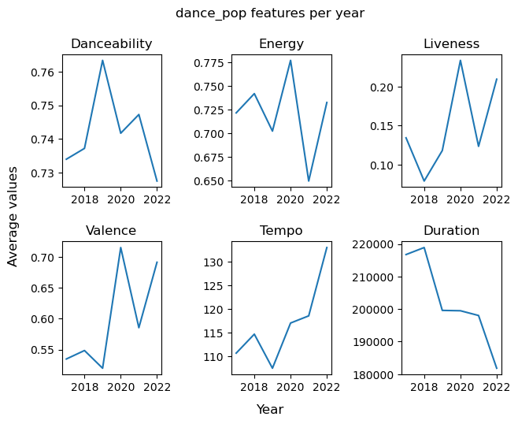
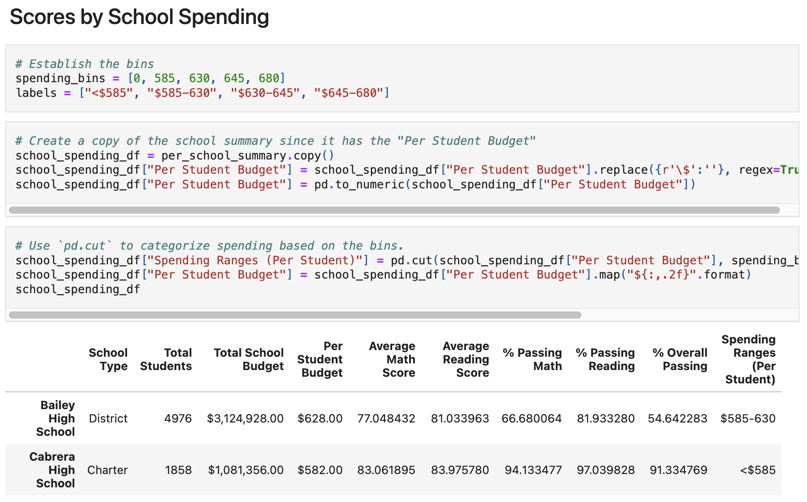
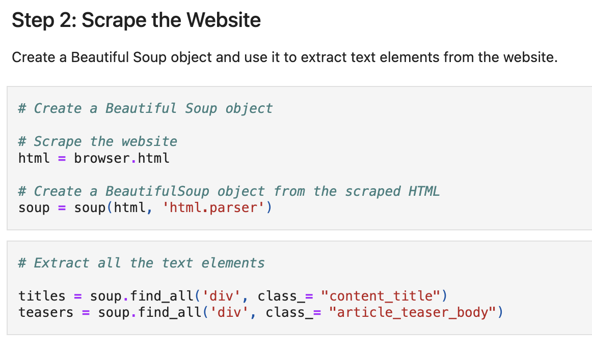
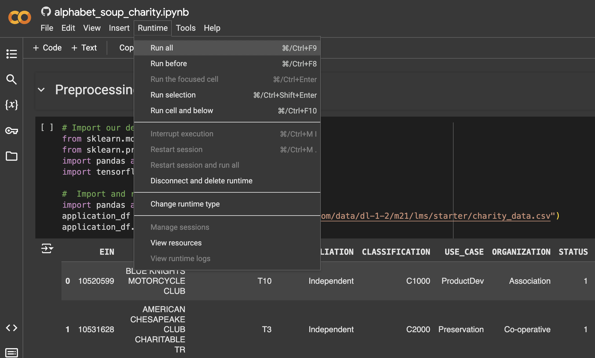

# University of Birmingham Data Analytics Bootcamp
# Assignment Hub
This Assignment Hub showcases the coursework from the University of Birmingham Data Analytics Bootcamp (Oct 2023 cohort).

## Contents
1. [Group Projects](#1-group-projects)
   - [Project 1 - Exploratory Data Analysis: Music Listening Habits on Spotify](#project-1---exploratory-data-analysis-music-listening-habits-on-spotify)
   - [Project 2 - Crowdfunding ETL](#project-2---crowdfunding-etl)
   - [Project 3 - Garmin Data Engineering](#project-3---garmin-data-engineering)
   - [Project 4 - Diabetes Prediction](#project-4---diabetes-prediction)

2. [Challenges](#2-challenges)
   - [excel-challenge](#excel-challenge) - Crowdfunding Data Analysis with Microsoft Excel
   - [VBA-challenge](#vba-challenge) - Stock Market Analysis with VBA
   - [python-challenge](#python-challenge) - Python Data Analysis Applications: PyBank and PyPoll
   - [pandas-challenge](#pandas-challenge) - PyCitySchools: School District Performance Analysis with Pandas
   - [module5-challenge](#module5-challenge) - Pymaceuticals: Data Visualisation and Statistical Analysis
   - [python-api-challenge](#python-api-challenge) - WeatherPy and VacationPy: API Data Retrieval and Visualisation
   - [sql-challenge](#sql-challenge) - EmployeeSQL Analysis and Database Setup
   - [sqlalchemy-challenge](#sqlalchemy-challenge) - SurfsUp: Climate Analysis and Flask API
   - [module11-challenge](#module11-challenge) - Mars News and Weather: Web Scraping and Data Analysis
   - [nosql-challenge](#nosql-challenge) - UK Food Hygiene Rating Analysis
   - [belly-button-challenge](#belly-button-challenge) - Belly Button Biodiversity Web Dashboard
   - [leaflet-challenge](#leaflet-challenge) - US Geological Survey Data Visualisation with Leaf.js
   - [tableau-challenge](#tableau-challenge) - Citi Bike Ridership Data Visualisation
   - [CryptoClustering](#cryptoclustering) - Cryptocurrency Price Change Prediction: Unsupervised Learning
   - [credit-risk-classification](#credit-risk-classification) - Loan Risk Prediction with Supervised Learning Models
   - [deep-learning-challenge](#deep-learning-challenge) - Charity Funding Predictions with Neural Network Models
   - [Home_Sales](#home_sales) - Home Sales Data Analysis with SparkSQL

---

## 1. Group Projects

### Project 1 - Exploratory Data Analysis: Music Listening Habits on Spotify
- **Overview:**

  This project analyses changes in music listening habits over the past six years, examining impacts from the COVID-19 pandemic and TikTok’s rise. Using Spotify’s yearly top 100 playlists from 2017 to 2022, we collected and prepared track data, including genre, popularity, and audio features, via the Spotipy API, integrating it into a structured dataframe. After extensive data cleaning and validation, we conducted exploratory data analysis to identify trends in song duration, genre shifts, and feature changes. Key findings highlight a decrease in song length, correlating with TikTok’s influence, and evolving trends in danceability, energy, and positivity.
  
- **Original Repository:** [https://github.com/catisf/Project-1-Group-2](https://github.com/catisf/Project-1-Group-2)
- **Fork:** [https://github.com/bernardtse/music-listening-habits-eda](https://github.com/bernardtse/music-listening-habits-eda)
- **Skills:** Python, Pandas, Matplotlib, JSON, EDA (exploratory data analysis)
- **Collaborators:** [Catarina Ferreira](https://github.com/catisf), [Daniel Hughes](https://github.com/DanielHughes1580), [Kehlani Jaan Khan](https://github.com/kehlanijaan), [Tafadzwa Fararira](https://github.com/BootcampCoderTF)

---

### Project 2 - Crowdfunding ETL
- **Overview:**

  This Crowdfunding ETL (Extract, Transform, Load) Mini Project involves building an ETL pipeline to process and analyse crowdfunding data. The project includes data extraction and transformation using Python and Pandas, followed by exporting the data into CSV files for further use. These CSV files are then used to create an Entity-Relationship Diagram (ERD) and a database schema, which are implemented in a PostgreSQL database. The processed data is analysed to provide meaningful insights into the crowdfunding campaign landscape.

- **URL:** [https://github.com/bernardtse/Crowdfunding_ETL](https://github.com/bernardtse/Crowdfunding_ETL)
- **Skills:** Python, PostgreSQL, data ETL (extract, load, transform)
- **Collaborators:** [Aysha Gheewala](https://github.com/AyshaGheewala), [Safa Ali](https://github.com/Safa297)

---

### Project 3 - Garmin Data Engineering
- **Overview:**

  This project develops a data engineering solution to analyse fitness patterns from Garmin wearable data, with user consent and a strong focus on privacy. By transforming data from Garmin watches into a structured database, the project enables insightful analysis of exercise behaviours, supporting individuals in optimising their fitness strategies. With additional visualisation by app or web developers, users can effectively track and enhance their health routines. Rooted in ethical data use, this initiative provides a scalable foundation for data-driven analysis in personal fitness.
  
- **Original Repository:** [https://github.com/NidaB-C/garmin-data-engineering](https://github.com/NidaB-C/garmin-data-engineering)
- **Fork:** [https://github.com/bernardtse/garmin-data-engineering](https://github.com/bernardtse/garmin-data-engineering)
- **Skills:** Python, SQLite, Flask, HTML, CSS, Javascript, data ETL
- **Collaborators:** [Aysha Gheewala](https://github.com/AyshaGheewala), [Mohammed Nawaz](https://github.com/MoNawaz101), [Nida Ballinger-Chaudhary](https://github.com/NidaB-C)

---

### Project 4 - Diabetes Prediction
- **Overview:**

  This project develops a predictive model to identify individuals at risk of diabetes using machine learning and health data, including BMI, age, blood pressure, and dietary habits. Using algorithms such as Logistic Regression, Random Forest, Decision Tree, SVM, KNN, and Neural Networks, the model analyses anonymised health records to uncover key risk factors for diabetes. The project also includes a user-friendly web application where users can input health parameters and receive diabetes risk predictions with explanations, supporting early detection and improved public health management.
  
- **URL:** [https://github.com/bernardtse/diabetes_prediction](https://github.com/bernardtse/diabetes_prediction)
- **Skills:** Python, PySpark, Seaborn, Scikit-learn (supervised learning), TensorFlow, HTML, CSS, Javascript, data ETL
- **Collaborators:** [Aysha Gheewala](https://github.com/AyshaGheewala), [Godswill Anyasor](https://github.com/AnyasorG), [Kehlani Jaan Khan](https://github.com/kehlanijaan)

---

## 2. Challenges

### excel-challenge
Crowdfunding Data Analysis with Microsoft Excel

- **Overview:**

  This repository contains an Excel file that features a series of analyses performed on crowdfunding campaign data. The data, obtained from a dataset of 1,000 sample projects, has been processed to uncover insights into market trends, campaign outcomes, and other related metrics. The aim of the project is to analyse various factors that determine the success or failure of crowdfunding campaigns.

  Conditional formatting was applied to the `Outcome` and `Percent Funded` columns to visually highlight the campaign results and funding progress. Additionally, formulas such as `COUNTIFS()`, `AVERAGE()`, and `STDEV()` were used to calculate key metrics, including success rates and average donations. Pivot tables and charts were then created to summarise and visualise trends in the data, such as the number of successful campaigns across different categories and the relationship between campaign goals and outcomes. These methods collectively helped uncover patterns and provided valuable insights into the crowdfunding data.

- **URL:** [https://github.com/bernardtse/excel-challenge](https://github.com/bernardtse/excel-challenge)
- **Skills:** Excel

---

### VBA-challenge
Stock Market Analysis with VBA

- **Overview:**

  This challenge focuses on analysing stock market data using VBA (Visual Basic for Applications) scripting in Excel. The task is to create a script that loops through quarterly stock data and calculates key metrics, including the ticker symbol, quarterly price changes, percentage change, total stock volume, and highlights the stocks with the greatest percentage increase, greatest percentage decrease, and greatest total volume. Additionally, the script applies conditional formatting to highlight positive and negative changes in stock prices, making the results visually clear and easy to interpret.

- **URL:** [https://github.com/bernardtse/VBA-challenge](https://github.com/bernardtse/VBA-challenge)
- **Skills:** Excel, VBA

---

### python-challenge
Python Data Analysis Applications: PyBank and PyPoll

- **Overview:**

  This challenge involves creating two Python-based data analysis applications: **PyBank** and **PyPoll**. These apps simulate real-world scenarios where Python programming is used to replace Excel for advanced data analysis tasks.  

  **PyBank** focuses on analysing financial records to extract key insights such as total profits, average changes, and identifying significant profit fluctuations.  

  **PyPoll** is designed to modernise a rural town’s vote-counting process by determining election results, vote percentages, and identifying the winner through Python scripting.

- **URL:** [https://github.com/bernardtse/python-challenge](https://github.com/bernardtse/python-challenge)
- **Skills:** Python

---

### pandas-challenge
PyCitySchools: School District Performance Analysis with Pandas

- **Overview:**

  In this challenge, the analysis of school and standardised test data for a city’s school district was performed. The goal was to extract key metrics about student performance, school spending, school size, and type. Using Pandas and Jupyter Notebook, various calculations and aggregations were made to generate insights, trends, and performance summaries for different schools within the district. Patterns such as the impact of school size and spending on student performance were revealed, providing valuable information for strategic decisions regarding future school budgets and priorities. The project involved creating multiple dataframes to showcase performance across several dimensions, including district-wide averages, school-specific summaries, and performance rankings.
  
- **URL:** [https://github.com/bernardtse/pandas-challenge](https://github.com/bernardtse/pandas-challenge)
- **Skills:** Python, Pandas

---

### module5-challenge
Pymaceuticals: Data Visualisation and Statistical Analysis

- **Overview:**

  This challenge focuses on analysing preclinical study data from Pymaceuticals, Inc., a pharmaceutical company researching treatments for squamous cell carcinoma (SCC), a common form of skin cancer. The study involved 249 mice treated with various drug regimens over 45 days, with tumour development observed and recorded. The goal was to compare the effectiveness of the company’s drug of interest, Capomulin, against other treatments.  

  As the senior data analyst, the task was to clean and process the data, conduct statistical analyses, and generate visualisations to summarise findings. Key aspects included calculating summary statistics, identifying outliers, performing correlation and regression analyses, and creating plots to effectively communicate the results. This challenge required strong skills in data manipulation, statistical interpretation, and visual storytelling using Python and Matplotlib.

- **URL:** [https://github.com/bernardtse/module5-challenge](https://github.com/bernardtse/module5-challenge)
- **Skills:** Python, Pandas, Matplotlib, NumPy, SciPy

---

### python-api-challenge
WeatherPy and VacationPy: API Data Retrieval and Visualisation

- **Overview:**

  This challenge explores global weather patterns and demonstrates how weather data can guide vacation planning. Using Python, the analysis examines the relationship between latitude and weather variables like temperature, humidity, cloudiness, and wind speed. Skills applied include data retrieval through APIs (OpenWeatherMap and Geoapify), data cleaning and manipulation using pandas, and statistical analysis with linear regression. The results are visualised through scatter plots, regression charts, and interactive maps created with Matplotlib and hvPlot. This challenge highlights the use of programming, API integration, and data visualisation to extract meaningful insights from real-world weather data.
  
- **URL:** [https://github.com/bernardtse/python-api-challenge](https://github.com/bernardtse/python-api-challenge)
- **Skills:** Python, JSON, Pandas, MatPlotlib, hvPlot

---

### sql-challenge
EmployeeSQL Analysis and Database Setup

- **Overview:**

  This project focuses on analysing historical employee data for Pewlett Hackard, a fictional company, using PostgreSQL. The primary objectives include designing an Entity Relationship Diagram (ERD), creating a database schema, importing CSV data, and running SQL queries to answer key analytical questions. The dataset represents employees, their departments, titles, salaries, and managerial roles during the 1980s and 1990s.
  
- **URL:** [https://github.com/bernardtse/sql-challenge](https://github.com/bernardtse/sql-challenge)
- **Skills:** PostgreSQL

---

### sqlalchemy-challenge
SurfsUp: Climate Analysis and Flask API

- **Overview:**

  This challenge analyses climate data for Honolulu, Hawaii, to aid in planning a holiday trip. It uses Python, SQLAlchemy, Pandas, Matplotlib, and Flask to explore historical weather data, perform precipitation and station analyses, and provide a Flask API for dynamic data retrieval. The analysis includes precipitation trends, station activities, and temperature observations, alongside API endpoints for data access.
  
- **URL:** [https://github.com/bernardtse/sqlalchemy-challenge](https://github.com/bernardtse/sqlalchemy-challenge)
- **Skills:** Python, SQLAlchemy, SQLite, Pandas, Matplotlib, Flask

---

### module11-challenge
Mars News and Weather: Web Scraping and Data Analysis

- **Overview:**

  This challenge involves scraping and analysing data related to Mars using web scraping techniques. Part 1 focuses on scraping news articles from NASA's Mars News website to extract titles and previews of the latest articles. Part 2 involves scraping and analysing weather data from the Mars Temperature Data Site, which includes insights about temperature and atmospheric pressure. The results are designed to be insightful and visually accessible.
  
- **URL:** [https://github.com/bernardtse/module11-challenge](https://github.com/bernardtse/module11-challenge)
- **Skills:** Python, Beautiful Soup (web scraping)

---

### nosql-challenge
UK Food Hygiene Rating Analysis

- **Overview:**

  The UK Food Standards Agency assesses food hygiene ratings for establishments across the United Kingdom. This project analyses data from the agency to help journalists at *Eat Safe, Love* identify key insights for articles. The analysis is carried out using MongoDB and Jupyter Notebooks, focusing on data manipulation, updates, and exploratory queries.
  
- **URL:** [https://github.com/bernardtse/nosql-challenge](https://github.com/bernardtse/nosql-challenge)
- **Skills:** Python, NoSQL (MongoDB)

---

### belly-button-challenge
Belly Button Biodiversity Web Dashboard

- **Overview:**

  The Belly Button Biodiversity Dashboard is an interactive visualisation tool designed to explore the Belly Button Biodiversity dataset. This dataset catalogues the microbes that colonise human navels. The study reveals that a small number of microbial species, known as operational taxonomic units (OTUs), are present in over 70% of individuals. However, the majority of species are relatively rare. 

  The dashboard allows users to analyse this microbial diversity through dynamic visualisations, including bar and bubble charts. It also displays demographic metadata associated with each sample. By enabling the selection and examination of individual samples, the project highlights the significance of microbial presence and variation within the human navel microbiome.

- **URL:** [https://github.com/bernardtse/belly-button-challenge](https://github.com/bernardtse/belly-button-challenge)
- **Skills:** HTML, CSS, Javascript, D3.js, Plotly.js, Bootstrap

---

### leaflet-challenge
US Geological Survey Data Visualisation with Leaflet.js

- **Overview:**

  The United States Geological Survey (USGS), is responsible for providing scientific data about natural hazards, the health of our ecosystems and environment, and the impacts of climate and land-use change. This challenge aims to visualise USGS data that will allow them to better educate the public and other government organisations (and hopefully secure more funding) on issues facing our planet.
  
- **URL:** [https://github.com/bernardtse/leaflet-challenge](https://github.com/bernardtse/leaflet-challenge)
- **Skills:** HTML, CSS, Javascript, Leaflet.js

---

### tableau-challenge
Citi Bike Ridership Data Visualisation

- **Overview:**

  The Citi Bike programme, the largest bike-sharing initiative in the United States, has been collecting and organising ridership data since 2013. This challenge focuses on developing a Tableau workbook that contains a story with five interactive dashboards to illustrate insights and patterns in Citi Bike ridership. The analysis compares data from June 2023 (summer) and December 2023 (winter) to answer key questions regarding riding patterns throughout the year. The workbook is designed for city officials, with a focus on non-technical readers, to easily understand and draw insights from the data.
  
- **URL:** [https://github.com/bernardtse/tableau-challenge](https://github.com/bernardtse/tableau-challenge)
- **Skills:** Tableau

---

### CryptoClustering
Cryptocurrency Price Change Prediction: Unsupervised Learning

- **Overview:**

  This challenge focuses on predicting whether cryptocurrencies are influenced by 24-hour or 7-day price changes using Python and unsupervised learning. The prediction process is conducted twice: first, using the original data, and second, using Principal Components Analysis (PCA) data. The results are then compared to determine the optimal approach for unsupervised learning.
  
- **URL:** [https://github.com/bernardtse/CryptoClustering](https://github.com/bernardtse/CryptoClustering)
- **Skills:** Python, Scikit-learn (unsupervised learning)

---

### credit-risk-classification
Loan Risk Prediction with Supervised Learning Models

- **Overview:**

  This challenge uses various techniques to train and evaluate a supervised machine learning model based on loan risk. A dataset of historical lending activity from a peer-to-peer lending services company is used to build a model that can identify the creditworthiness of borrowers.
  
- **URL:** [https://github.com/bernardtse/credit-risk-classification](https://github.com/bernardtse/credit-risk-classification)
- **Skills:** Python, Scikit-learn (supervised learning)

---

### deep-learning-challenge
Charity Funding Predictions with Neural Network Models

- **Overview:**

  The non-profit foundation Alphabet Soup requires a tool to select funding applicants with the highest chance of success in their ventures. Using machine learning and neural networks, this challenge involves creating a binary classifier to predict whether applicants funded by Alphabet Soup will be successful.
  
- **URL:** [https://github.com/bernardtse/deep-learning-challenge](https://github.com/bernardtse/deep-learning-challenge)
- **Skills:** Python, TensorFlow

---

### Home_Sales
Home Sales Data Analysis with SparkSQL

- **Overview:**

  This challenge uses SparkSQL to determine key metrics about home sales data. Spark will be used to create temporary views, partition the data, cache and uncache a temporary table, and verify that the table has been uncached.
  
- **URL:** [https://github.com/bernardtse/Home_Sales](https://github.com/bernardtse/Home_Sales)
- **Skills:** Python, PySpark

